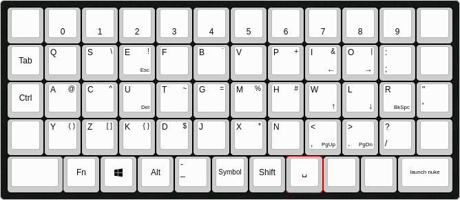

# Rethinking Keyboard Layout

(Play with this keyboard draft by pluggin [./asethior.json](./asethior.json) into [this site](http://www.keyboard-layout-editor.com/))

## Personal Motivation

Disclaimer: I'm not making any attempt to say that these problems are considered problems by anyone other than myself.

I am a programmer. I use a QWERTY keyboard layout.

- When I move my fingers to the bottom row of letters, the comfortable movement would just be straight down. I don't like how the rows are not aligned.
- I only ever use the spacebar in the spot under the J key.
- I don't like moving my hands to reach the backspace, delete, escape, arrow, and enter keys.
- I don't use the right-side control or shift keys.
- I don't like how using the shift key moves my left hand away from it's regular position and requires it to stretch to reach keys closer to the middle while holding it down.
- I don't like moving my left hand down or doing pinky contortions to reach the control key.

## Proposals

- Make the keys align to a grid.
- Use the leftmost square of the original spacebar be the shift key. This way, shift can be pressed with the left thumb, which places much less restriction on left-hand movement.
- Use the second-rightmost square of the original spacebar as the dash/underscore key. To a programmer, they are separators just as much as the space key is.
- Let the left alt key be a special key for _user_ keyboard combinations.
  - I use this to map the backspace, delete, arrow, escape, and enter keys to letter keys.
- Use the caps lock key as the control key. It is easy to reach with the pinky without having to move the left hand.

